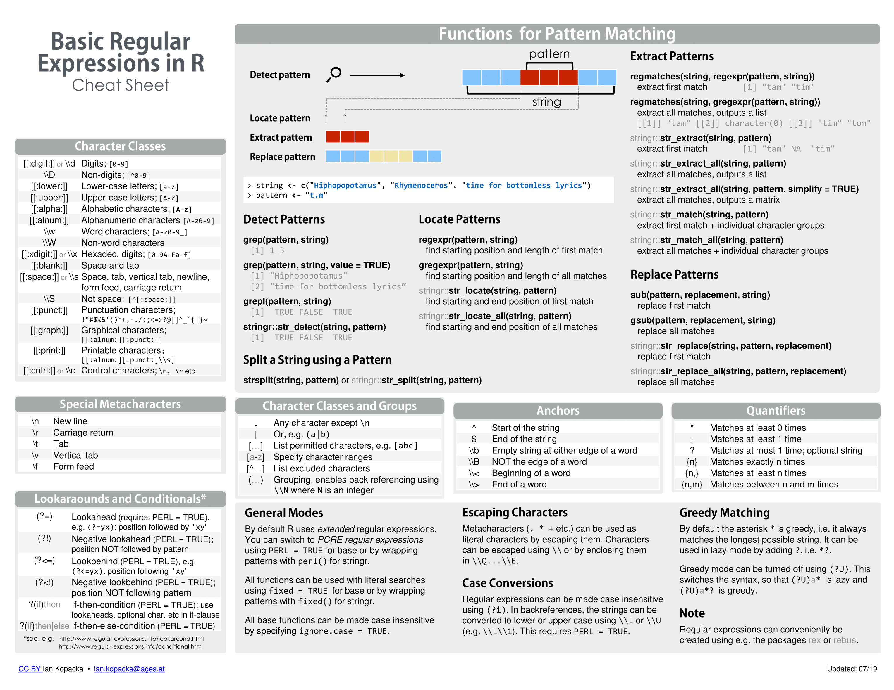

## Tidy Data

**tidy data:** each row represents one observation and the columns represents the different variables that we have data on for those observations.

## Wide Data

**wide data:** each row includes several observations and one of the variables is stored in the header.

## pivot_longer(1st, 2nd)

**pivot_longer(1st, 2nd):** -- converts wide data into tidy data.

-   1st (first argument) is the data frame to be reshaped.
-   2nd (second argument) specifies the columns containing the values to be moved into a single column.

## pivot_wider(1st)

**pivot_wider(1st):** -- converts tidy data into wide data. Can be a useful intermediate step in data tidying.

-   1st (first argument) is the data frame to be reshaped.
-   `names_from` tells which variable will be used for the column names
-   `values_from` tells which variable to use to fill in the values.

## Separate(1st, 2nd, 3th)

**separate(1st, 2nd, 3th)** — splits one column into two or more columns at a specified character that separates the variables.

-   1st - the name of the column to be separated.

-   2nd - the names to be used for the new columns.

-   3th - character that separates the variables.

If there is an extra separation, we can use `extra = "merge"` to merge the last two variables.

## Unite()

**unite(1st, 2nd, 3rd, 4th)** — joins to columns into one.

-   1st - is the name of the new column.

-   2nd - is the name of the first part of the new column.

-   3rd - is the name of the second part of the new column.

-   4th - is the separator to use between values.

## Combining Tables

The `join` functions in the **dplyr** package combine two tables such that matching rows are together.

-   `left_join()` - only keeps rows that have information in the first table.
-   `right_join()` - only keeps rows that have information in the second table.
-   `inner_join()` - only keep rows that have information in the both tables.
-   `full_join()` - keeps all rows from both tables.
-   `semi_join()` - keeps the part of the first tables for which we have information in the second.
-   `anti_join()` - keeps the elements of the first table for which we there is no information in the second.

### Binding

Unlike the join functions, the binding functions do not try to match by a variable, but rather just combine datasets.

-   `bind_cols()` - binds two objects by making them columns in a tibble.

    -   The R-base function `cbind()` bind columns but makes a data frame or matrix instead.

-   `bind_rows()` - function is similar but binds rows instead of a columns.

    -   The R-base function `rbind()` binds rows but makes a data frame or matrix instead.

### Set Operators

By default, the set operators in R-base work on vectors. If **tidyverse/dplyr** are loaded, they also work on data frames.

-   `intersect()` - take intersections of vectors. This returns the elements common to both sets.

-   `union()` - take union of vectors. This return the elements that are in either set.

-   `setdiff()` - set difference between a first and second argument.

    -   this function is not symmetric.

-   `set_equal()` - tells if two sets are the same, regardless of the order of elements.

## Web Scraping

**Web scraping** or **web harvesting** — are the term used to describe the process of extracting data from a website.

The `rvest` web harvesting package includes functions to extract nodes of an HTML document:

-   `html_nodes()` — extracts all nodes of different types

-   `html_node()` — extracts the first node.

The `html_table()` — converts an HTML table to a data frame.

# String Processing

The most common tasks in string processing include:

-   extracting numbers from strings

-   removing unwanted characters from text

-   finding and replacing characters

-   extracting specific parts of strings

-   converting free form text to more uniform formats

-   splitting strings into multiple values

The **stringr** package in the **tidyverse** contains string processing functions that follow a similar (`str_functionname`) and are compatible with the pipe.

### Define Strings

-   Define a string by surrounding text with either single quotes or double quotes.

-   To include single quote inside a string, use a double quotes on the outside `"10'"`. To include a double quote inside a string, use single quotes on the outside `'10"'` .

-   The **cat()** function displays a string as it is represented inside R.

-   To include a double quote inside of a string surrounded by double quotes, use the **backslash ( \\ )** to escape the double quote `"5'10\""`. Escape a single quote to include it inside of a string defined by single quotes `'5\'10"'`.

### stringr package

-   The main types of string processing tasks are: detecting, locating, extracting and replacing elements of strings.

-   The **stringr** package from the **tidyverse** includes a variety of string processing functions that begin with `str_` and take the string as the first argument, which makes them compatible the the pipe.

-   The `str_detect()` can determine whether a string contains a certain pattern.

-   The `str_replace_all()` can replace all instances of one pattern with another pattern. To remove a pattern, replace with the empty string `("")`.

-   The `parse_number()` removes punctuation from strings and converts them to numeric.

-   The `mutate_at()` performs the same transformation on the specified column numbers.

### Problems

-   When there are both text and numeric entries in a column, the column will be a character vector. Converting this column to numeric will result in NAs for some entries.

-   To correct problematic entries, look for patterns that are shared across large numbers of entries, then define rules that identify those patterns and use these rules to write string processing tasks.

-   Use `suppressWarnings()` to hide warning messages for a function.

## RegEx

A regular expression (regex) is a way to describe a specific pattern of characters of text. A set rules has been designed to do this specifically and efficiently.

-   **stingr** functions can take regex as a pattern.

-   `str_detect()` indicates whether a pattern is present in a string.

-   The main difference between a regex and a regular string is that a regex can include special character.

-   The `|` symbol inside a regex means "or".

-   Use '\\\\d' to represent digits. The backslash is used to distinguish it from the character 'd'. In R, we must use two backslashes for digits in regular expressions; in some other languages, we will only use one backslash for regex special characters.

-   The `str_view()` highlights the first occurrence of the pattern, and the `str_view_all` highlights all occurrence of the pattern ( but it is deprecated )

### Character Classes, Anchors and Quantifiers

Define strings to test your regular expressions, including some elements that matches and some that do not. This allow to check for the two types of errors: **failing to match** and **matching incorrectly**.

-   **Character classes** — groups of characters that count as matching pattern. To define character classes we use ranges, such as [0-9] for digits and [a-zA-Z] for all letters.

-   **Anchors** — define patterns that must start or end at specific places. **\^** and **\$** represent the beginning and end of the string respectively.

-   **Quantifiers** — state how many times a certain character can be repeated in the pattern. To define them we use Curly braces. `\\d{1,2}` matches exactly 1 or 2 consecutive digits.

{width="780"}

### Search and replace with RegEx

-   `str_replace()` replaces the first instance of the detected pattern with a specified string.

-   Spaces are characters and R does not ignore them. Spaces are specified by the special character **\\\\s.**

-   Additional quantifiers include \*, + and ?.

    -   `*` means 0 or more instances of the previous characters.

    -   `+` means 0 or 1 instances.

    -   `?` means 1 or more instances.

-   Before removing characters from strings with functions like `str_replace()` and `str_replace_all()` , consider whether that replacement would have unintended effects.

### Groups with RegEx

*Groups* are a powerful aspect of regex that permits the extraction of values. Groups are defined using parentheses. They don’t affect the pattern matching per se. Instead, it permits tools to identify specific parts of the pattern so we can extract them.

-   Once we defined groups, we can use the function `str_match()` to extract the values these groups define. `str_extract()` extracts only strings that match a pattern, not the values defined by groups.

-   We can refer to the **i**th group with **\\\\i**.

    -   For example, refer to the value in the second group with \\\\2.
